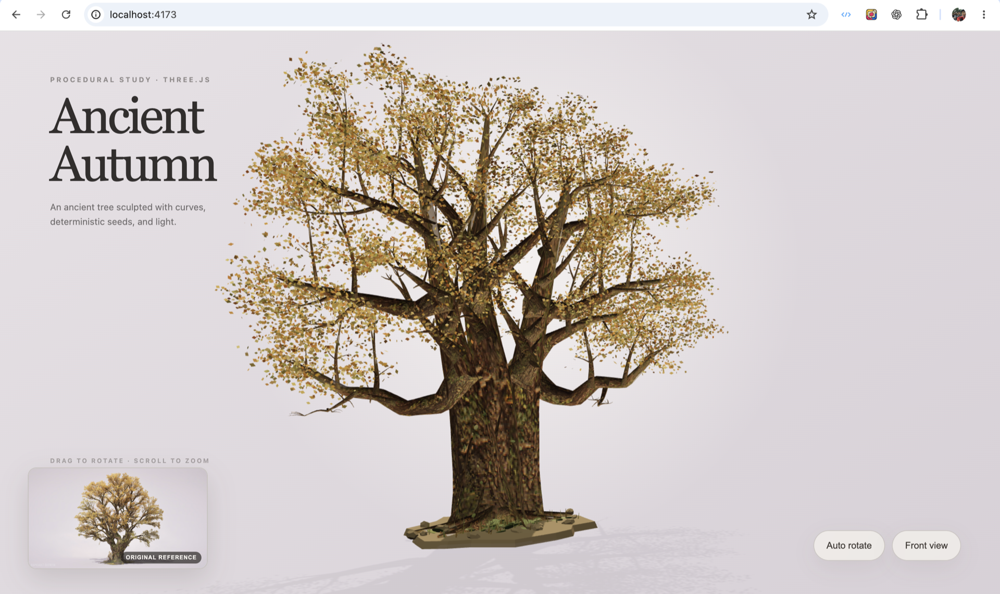

# Three.js Object Sculptor

Turn the object in an attached image into a quality-gated, animation-ready procedural Three.js model built entirely with code.

Three.js Object Sculptor is a Codex plugin for rebuilding the visible object in a user-provided attachment image as a code-only Three.js model. It does not try to do photogrammetry, download an art pack, or extract a perfect mesh from one image. Instead, it guides Codex through a sculpting workflow: validate the image, describe the object precisely, decompose it into geometry and material systems, build from blockout to detail, wire an animation-friendly hierarchy, then compare the browser render against the original reference.

## Demo

### Tower Ship

[Open the live tower ship demo](https://3dship.harrysoftware.com)


This tower ship study shows the intended output shape: a browser-rendered, code-sculpted Three.js object rebuilt from an attached reference image, with procedural geometry, articulated parts, material work, and interactive controls.

### Ancient Autumn Tree

[Open the live ancient autumn tree demo](https://tree.harrysoftware.com/)



This botanical study reconstructs a complex ancient tree with procedural curves, deterministic branching, layered bark materials, dense autumn foliage, and an animation-ready hierarchy.

## At A Glance

- **Name:** Three.js Object Sculptor
- **Category:** Codex plugin for image-to-procedural-3D workflows
- **Input:** an attached object image, reference screenshot, or local image path
- **Output:** a code-only procedural Three.js object factory, backed by an `ObjectSculptSpec`
- **Primary goal:** recreate the target object's silhouette, component structure, materials, lighting response, and action-ready hierarchy in browser-friendly Three.js code
- **Best for:** animation-ready real-time props, game objects, scene dressing, destructible objects, product-style objects, botanical objects, mechanical parts, and stylized reference reconstructions
- **Not for:** photogrammetry, exact mesh extraction, scanned assets, downloaded art packs, or guaranteed production-perfect geometry from one image

## What It Does

- Validates whether an image is suitable for procedural 3D reconstruction.
- Creates a pre-spec complexity assessment before code generation.
- Writes an `ObjectSculptSpec` with component hierarchy, materials, lighting, pivots, sockets, animation anchors, destruction anchors, and quality targets.
- Enforces a staged build pipeline: blockout, structural pass, form refinement, material pass, surface pass, lighting pass, interaction pass, and optimization.
- Generates a code-only Three.js factory skeleton from the current unlocked sculpt pass.
- Designs the generated object as an action-ready hierarchy, so later animation, transformation, physics, or destruction requests have real pivots and attachment points to use.
- Packages reference/render screenshots into one comparison sheet for AI vision review.
- Records self-correction reviews with overall, layer, and critical feature scores.
- Supports reference-derived procedural PBR evidence: albedo, roughness estimate, height, normal, and AO maps.

## Use Cases

- Convert an attached object image into a procedural Three.js model generated entirely with TypeScript and geometry code.
- Build animation-ready Three.js props with meaningful pivots, sockets, parent-child hierarchy, and transform anchors.
- Recreate reference objects as browser-friendly procedural assets without relying on downloaded meshes or external art packs.
- Generate a structured object spec before implementation, so Codex understands geometry, materials, lighting, local surface features, and interaction readiness.
- Create destructible or transformable objects by planning detachable parts, fracture seams, colliders, and effect emitters before the model is coded.
- Compare the rendered model against the original attachment with AI vision and block progress when critical features do not match.
- Produce reusable procedural object factories for Three.js games, WebGPU demos, interactive prototypes, and visual experiments.

## Why This Exists

Procedural 3D generation can fail in a very specific way: the silhouette is "kind of right", but the object loses the details that make it recognizable. This plugin is designed to slow Codex down at the right moments:

- First understand what object class and complexity tier it is dealing with.
- Define what "good enough" means for this specific object.
- Build from coarse structure to fine surface response.
- Fail a pass if an identity-defining feature is wrong, even when the overall score looks acceptable.

The result is less "one-shot generated mesh" and more "Codex as a procedural sculptor with checkpoints": block out the form, attach the moving parts correctly, layer the materials, then keep refining until the model reads like the object in the attachment.

## Requirements

- Codex with local plugin support.
- Python 3.10 or newer.
- A browser project using Three.js when you want to implement the generated factory.
- For visual acceptance: a screenshot from the rendered model and an AI vision reviewer.

The helper scripts use Python standard-library modules and shell image tooling when available. They do not require Playwright or a downloaded Chromium bundle.

## Install For Codex

Clone the plugin source into your local plugin folder. Replace `REPOSITORY_URL` with the Git URL for your copy of this repository:

```bash
mkdir -p ~/plugins
git clone REPOSITORY_URL ~/plugins/threejs-object-sculptor
```

Make sure your local Codex marketplace has an entry for the plugin. If you already have `~/.agents/plugins/marketplace.json`, add this object to its `plugins` array:

```json
{
  "name": "threejs-object-sculptor",
  "source": {
    "source": "local",
    "path": "./plugins/threejs-object-sculptor"
  },
  "policy": {
    "installation": "AVAILABLE",
    "authentication": "ON_INSTALL"
  },
  "category": "Productivity"
}
```

If you do not have a local marketplace file yet, create `~/.agents/plugins/marketplace.json` with:

```json
{
  "name": "local",
  "interface": {
    "displayName": "Local Plugins"
  },
  "plugins": [
    {
      "name": "threejs-object-sculptor",
      "source": {
        "source": "local",
        "path": "./plugins/threejs-object-sculptor"
      },
      "policy": {
        "installation": "AVAILABLE",
        "authentication": "ON_INSTALL"
      },
      "category": "Productivity"
    }
  ]
}
```

Install it in Codex:

```bash
codex plugin add threejs-object-sculptor@local
```

Start a new Codex thread after installation so the plugin skill is loaded.

## Quick Start

In Codex, attach an object image and ask:

```text
Use Three.js Object Sculptor to turn the object in this attachment into a procedural Three.js model built entirely with code.
```


For best results, include the intended use:

```text
Make it a real-time browser prop, action-ready for animation, transformation, physics, and destruction.
```

The plugin will guide Codex through:

1. Image suitability check.
2. Pre-spec complexity and quality contract.
3. Detailed object sculpt spec.
4. Strict validation.
5. Pass-by-pass Three.js factory generation.
6. Browser screenshot review.
7. AI vision comparison and self-correction.

## Recommended Workflow

Use the scripts from the plugin root.

Probe a reference image:

```bash
python3 scripts/probe_reference_image.py ./reference/oak-tree.png
```

Create a pre-spec assessment:

```bash
python3 scripts/new_pre_spec_assessment.py "Ancient Autumn Oak" \
  --image ./reference/oak-tree.png \
  --complexity complex \
  --out assessment.json
```

Create a starter sculpt spec:

```bash
python3 scripts/new_sculpt_spec.py "Ancient Autumn Oak" \
  --image ./reference/oak-tree.png \
  --assessment assessment.json \
  --out object-sculpt-spec.json
```

Validate the spec:

```bash
python3 scripts/validate_sculpt_spec.py object-sculpt-spec.json --strict-quality
```

Check which sculpt pass is unlocked:

```bash
python3 scripts/sculpt_pass_orchestrator.py status object-sculpt-spec.json
```

Generate the current pass:

```bash
python3 scripts/generate_threejs_factory.py object-sculpt-spec.json \
  --out src/createObjectModel.ts
```

Create a comparison sheet after rendering the model:

```bash
python3 scripts/make_visual_comparison_sheet.py \
  --reference ./reference/oak-tree.png \
  --render ./screenshots/oak-render.png \
  --out ./screenshots/oak-comparison.png \
  --json
```

Record an AI vision review:

```bash
python3 scripts/append_sculpt_review.py object-sculpt-spec.json \
  --pass-id blockout \
  --fidelity 0.82 \
  --action continue \
  --summary "Blockout silhouette and primary trunk fork are acceptable." \
  --render-screenshot ./screenshots/oak-render.png \
  --comparison-image ./screenshots/oak-comparison.png \
  --ai-vision-score 0.82 \
  --feature-reviews-json ./reviews/blockout-features.json \
  --ai-vision-notes "Main proportions pass; canopy microstructure remains deferred." \
  --in-place
```

Sync the pass state:

```bash
python3 scripts/sculpt_pass_orchestrator.py sync object-sculpt-spec.json --in-place
```

## PBR Extraction

The plugin can extract reference-derived procedural PBR evidence from image pixels:

```bash
python3 scripts/extract_reference_pbr.py ./reference/oak-bark.png \
  --out-dir ./generated/pbr/oak-bark \
  --material-id bark \
  --target-threshold 0.7 \
  --report ./generated/pbr/oak-bark/report.json
```

This produces useful material evidence such as palette, albedo, roughness estimate, height, normal, and AO maps. It is not exact inverse rendering from a single image. When confidence is below the threshold, the script refuses to patch the spec unless `--allow-low-confidence` is explicitly used.

## Quality Gates

The plugin uses two levels of visual acceptance:

- Overall match: silhouette, proportions, camera/view, material read, and lighting.
- Semantic feature match: selected critical object features scored from the same full reference/render comparison image.

Examples of critical feature targets:

- Hull shape, cabin blocks, sail rigging, and rails for a boat.
- Trunk fork, major branch sockets, canopy mass, bark material, and root flare for a tree.
- Body shell, wheels, windshield, grille, and headlight clusters for a vehicle.

If a critical feature fails its threshold, the pass fails even if the global score is high.

## FAQ

### Is this photogrammetry?

No. Three.js Object Sculptor does not reconstruct a scanned mesh from pixels. It helps Codex infer a procedural model plan and generate Three.js code that approximates the visible object.

### Does it generate a GLB file?

Not by default. The main output is a code-only Three.js factory and an `ObjectSculptSpec`. You can add export tooling in the target Three.js project if you later need GLB output.

### Can the generated model be animated?

Yes. Animation readiness is a core goal. The spec asks for pivots, sockets, parent-child hierarchy, transform channels, collider proxies, and detachable or breakable component roles where relevant.

### Does it use downloaded assets or art packs?

No. The workflow is designed around generated geometry, procedural materials, local image evidence, and code-native Three.js construction.

### Can one image create an exact production model?

No. One image can be enough for a useful procedural reconstruction, but hidden sides, exact dimensions, and fine material behavior may need assumptions, extra reference views, or a lower-fidelity target.

### How does the plugin decide whether the model is good enough?

It uses a quality contract, staged build passes, browser screenshots, one reference/render comparison sheet, and AI vision review. Critical features can fail a pass even when the global visual score looks acceptable.

## Project Layout

```text
.codex-plugin/plugin.json
skills/object-to-threejs-procedural/SKILL.md
skills/object-to-threejs-procedural/references/
scripts/
```

Important scripts:

- `probe_reference_image.py`: technical image metadata probe.
- `new_pre_spec_assessment.py`: complexity and quality-contract skeleton.
- `new_sculpt_spec.py`: starter `ObjectSculptSpec`.
- `validate_sculpt_spec.py`: structural and strict quality validation.
- `sculpt_pass_orchestrator.py`: pass locking and pipeline sync.
- `generate_threejs_factory.py`: current-pass Three.js factory generator.
- `make_visual_comparison_sheet.py`: full reference/render comparison image.
- `append_sculpt_review.py`: self-correction review recorder.
- `extract_reference_pbr.py`: reference-derived PBR evidence extraction.

## Limitations

- A single image cannot reveal hidden sides or guarantee exact geometry.
- Transparent glass, smoke, liquid, fur, fine cloth, and exact likeness tasks may require extra references or a lower-fidelity target.
- The generated factory is a starting point for procedural construction, not a finished asset pipeline replacement.
- AI vision review is expected for acceptance; the scripts package evidence but do not magically judge visual quality by themselves.

## Development Notes

After changing the plugin, update the cachebuster and reinstall. If you have Codex's `plugin-creator` skill installed, use its `update_plugin_cachebuster.py` helper:

```bash
python3 /path/to/plugin-creator/scripts/update_plugin_cachebuster.py ~/plugins/threejs-object-sculptor
codex plugin add threejs-object-sculptor@local
```

Then open a new Codex thread to pick up the updated skill and scripts.

## License

MIT
